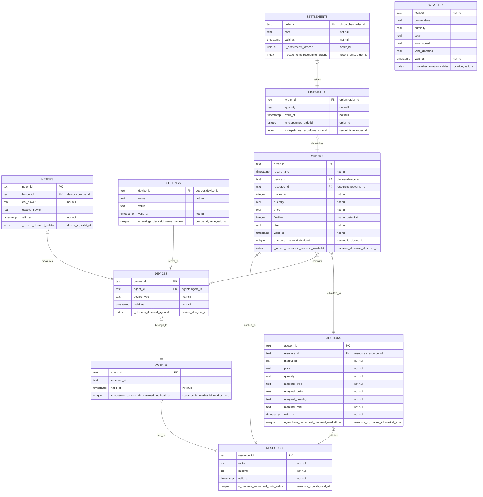

# Database Entity Relationships

# Database API

## `GET /db/resources?<args...>`

Get a list of all resources.

### Arguments

| Name | Type | Description |
| ---- | ---- | ----------- |
| unit | text | Limit result to resources having `units=<unit_id>` (optional).

### Returns

| Code | Body | Description |
| ---- | ---- | ----------- |
| 200 | `{"data" : ["<resource_id>", ...]}` | Resource list data found ok |
| 403 | `{"error" : "not authorized"}` | Access is denied |

### Access

| Authority | Agent   | Loader | Participants | Controllers | Settlement | Operators | Experimenters | Analysts | Developers |
| --------- | :-----: | :--------: | :----------: | :---------: | :--------: | :-------: | :-----------: | :------: | :--------: |
| Access    | &check; | &check;  | X            | &check;     | &check;    | &check;   | &check;       | &check;  | &check;    |

----
## `GET /db/resource/<resource_id>`

Gets data about a system resource.

### Returns

| Code | Body | Description |
| ---- | ---- | ----------- |
| 200 | `{"data" : {"resource_id" : "<resource_id>", "units" : "<units>", "interval" : <interval>}}` | The resource data was found ok |
| 403 | `{"error" : "not authorized"}` | Access is denied |
| 404 | `{"error" : "<resource_id> not found"}` | The constraint is not found |

### Access

| Authority | Agent   | Loader | Participants | Controllers | Settlement | Operators | Experimenters | Analysts | Developers |
| --------- | :-----: | :--------: | :----------: | :---------: | :--------: | :-------: | :-----------: | :------: | :--------: |
| Access    | &check; | &check;  | X            | &check;     | &check;    | &check;   | &check;       | &check;  | &check;    |

----
## `PUT /db/resource/<resource_id>?<args>`

Updates data about a system resource.
 
### Arguments

| Name | Type | Description |
| ---- | ---- | ----------- |
| resource_id | text | The resource identified |
| unit | text | The engineering units of the resource |
| interval | integer | The interval in seconds over which the resource is cleared for auction, NULL for orderbooks |

### Returns

| Code | Body | Description |
| ---- | ---- | ----------- |
| 200 | `{"data" : {"resource_id" : "<resource_id>", "units" : "<units>", "interval" : <interval>}}` | The resource data was updated ok. The data is for the previous entry. |
| 201 | `{"data" : {"resource_id" : "<resource_id>", "units" : "<units>", "interval" : <interval>}}` | The resource data was added ok. The data is for the validated entry. |
| 403 | `{"error" : "not authorized"}` | Access is denied |
| 404 | `{"error" : "<constraint_id> not found"}` | The resource is not found |  
| 406 | `{"error" : "<arg> is not valid"}` | Data validation failed

### Access

| Authority | Agent   | Loader | Participants | Controllers | Settlement | Operators | Experimenters | Analysts | Developers |
| --------- | :-----: | :--------: | :----------: | :---------: | :--------: | :-------: | :-----------: | :------: | :--------: |
| Access    | &check; | &check;  | X            | &check;     | &check;    | &check;   | &check;       | &check;  | &check;    |

----
## `GET /db/auctions?<args...>`

Get a list of auctions.

### Arguments

| Name | Type | Description |
| ---- | ---- | ----------- |
| constraint_id | text | Limit result to auctions on `constraint_id=<constraint_id>` (optional).
| market_id | int | Limit result to auctions on `market_id=<market_id>` (optional).

### Returns

| Code | Body | Description |
| ---- | ---- | ----------- |
| 200  | `{"data" : ["<auction_id>", ...]}` | Auction list data found ok |
| 403  | `{"error" : "not authorized"}` | Access is denied |

### Access

| Authority | Agent   | DataLoader | Participants | Controllers | Settlement | Operators | Experimenters | Analysts | Developers |
| --------- | :-----: | :--------: | :----------: | :---------: | :--------: | :-------: | :-----------: | :------: | :--------: |
| Access    | &check; | &check;  | X            | &check;     | &check;    | &check;   | &check;       | &check;  | &check;    |

----
## `GET /db/auction/<auction_id>`

### Returns

| Code | Body | Description |
| ---- | ---- | ----------- |
| 200 | `{"data" : {...}}` | Result obtained ok
| 403 | `{"error" : "access denied"}` | Access denied

### Access

| Authority | Agent   | Loader | Participants | Controllers | Settlement | Operators | Experimenters | Analysts | Developers |
| --------- | :-----: | :--------: | :----------: | :---------: | :--------: | :-------: | :-----------: | :------: | :--------: |
| Access    | &check; | &check;  | X            | &check;     | &check;    | &check;   | &check;       | &check;  | &check;    |

----
## `PUT /db/auction/<auction_id>?<args...>`

### Arguments

| Name | Type | Description |
| ---- | ---- | ----------- |
| constraint_id | text | Constraint id
| market_id | text | Market id
| price | real | Clearing price
| quantity | real | Clearing quantity
| marginal_type | text | Marginal clearing type
| marginal_order | text | Marginal order id
| marginal_quantity | real | Marginal order cleared quantity
| marginal_rank | integer | Marginal order rank number

### Returns

| Code | Body | Description |
| ---- | ---- | ----------- |
| 200 | `{"data" : {...}}` | The data was updated ok. The data is for the previous entry. |
| 201 | `{"data" : {...}}` | The data was added ok. The data is for the validated entry. |
| 403 | `{"error" : "not authorized"}` | Access is denied |
| 404 | `{"error" : "not found"}` | The record is not found |  
| 406 | `{"error" : "<arg> not valid"}` | Data validation failed

### Access

| Authority | Agent   | Loader | Participants | Controllers | Settlement | Operators | Experimenters | Analysts | Developers |
| --------- | :-----: | :--------: | :----------: | :---------: | :--------: | :-------: | :-----------: | :------: | :--------: |
| Access    | &check; | &check;  | X            | &check;     | &check;    | &check;   | &check;       | &check;  | &check;    |

----
## `GET /db/orders?<args...>`

Get a list of orders

### Arguments

| Name | Type | Description |
| ---- | ---- | ----------- |
| device_id | text | Limit result to orders having `device_id=<device_id>` optional.
| constraint_id | text | Limit result to orders having `constraint_id=<constraint_id>` optional.
| market_id | integer | Limit result to orders having `market_id=<market_id>` optional.
| price | real | Limit result to orders having `price <= -<price>` for price<0 or `price >= <price>` for price>=0  (optional).
| flexible | integer | Limit result to orders having `flexible=<flexible>` optional.

### Returns

| Code | Body | Description |
| ---- | ---- | ----------- |
| 200  | `{"data" : ["<order_id>", ...]}` | Order list data found ok |
| 403  | `{"error" : "not authorized"}` | Access is denied |

### Access

| Authority | Agent   | Loader | Participants | Controllers | Settlement | Operators | Experimenters | Analysts | Developers |
| --------- | :-----: | :--------: | :----------: | :---------: | :--------: | :-------: | :-----------: | :------: | :--------: |
| Access    | &check; | &check;  | X            | &check;     | &check;    | &check;   | &check;       | &check;  | &check;    |

----
## `GET /db/order/<order_id>`

### Returns

| Code | Body | Description |
| ---- | ---- | ----------- |
| 200 | `{"data" : {...}}` | Result obtained ok
| 403 | `{"error" : "access denied"}` | Access denied

### Access

| Authority | Agent   | Loader | Participants | Controllers | Settlement | Operators | Experimenters | Analysts | Developers |
| --------- | :-----: | :--------: | :----------: | :---------: | :--------: | :-------: | :-----------: | :------: | :--------: |
| Access    | &check; | &check;  | X            | &check;     | &check;    | &check;   | &check;       | &check;  | &check;    |

----
## `PUT /db/order/<order_id>?<args...>`

### Arguments

| Name | Type | Description |
| ---- | ---- | ----------- |
| device_id | text | Device id
| constraint_id | text | Constraint id
| market_id | integer | Market id
| quantity | real | Order quantity (negative for sell orders)
| price | real | Order price
| flexible | integer | Device flexibility (0=none, 1=quantity)
| state | real | Current quantity in use 

### Returns

| Code | Body | Description |
| ---- | ---- | ----------- |
| 200 | `{"data" : {...}}` | The data was updated ok. The data is for the previous entry. |
| 201 | `{"data" : {...}}` | The data was added ok. The data is for the validated entry. |
| 403 | `{"error" : "not authorized"}` | Access is denied |
| 404 | `{"error" : "not found"}` | The record is not found |  
| 406 | `{"error" : "<arg> not valid"}` | Data validation failed

### Access

| Authority | Agent   | Loader | Participants | Controllers | Settlement | Operators | Experimenters | Analysts | Developers |
| --------- | :-----: | :--------: | :----------: | :---------: | :--------: | :-------: | :-----------: | :------: | :--------: |
| Access    | &check; | &check;  | X            | &check;     | &check;    | &check;   | &check;       | &check;  | &check;    |

### Validation

| Name | Requirement |
| ---- | ----------- |
| quantity | Non-zero
| price | Between auction `price_floor` and `price_cap`
| constraint_id | Must match device's agent resource constraint

----
## `GET /db/dispatches?<args...>`

Get a list of dispatches.

### Arguments

| Name | Type | Description |
| ---- | ---- | ----------- |
| device_id | text | Limit result to dispatches for device_id (optional).
| agent_id | text | Limit result to dispatches for agent_id (optional).
| auction_id | text | Limit result to dispatches for auction_id (optional).
| market_id | integer | Limit result to dispatches for market_id (optional).
| constraint_id | text | Limit result to dispatches for constraint_id (optional).

### Returns

| Code | Body | Description |
| ---- | ---- | ----------- |
| 200  | `{"data" : ["<order_id>", ...]}` | Dispatch list data found ok |
| 403  | `{"error" : "not authorized"}` | Access is denied |

### Access

| Authority | Agent   | Loader | Participants | Controllers | Settlement | Operators | Experimenters | Analysts | Developers |
| --------- | :-----: | :--------: | :----------: | :---------: | :--------: | :-------: | :-----------: | :------: | :--------: |
| Access    | &check; | &check;  | X            | &check;     | &check;    | &check;   | &check;       | &check;  | &check;    |

----
## `GET /db/dispatch/<order_id>`

### Returns

| Code | Body | Description |
| ---- | ---- | ----------- |
| 200 | `{"data" : {...}}` | Result obtained ok
| 403 | `{"error" : "access denied"}` | Access denied

### Access

| Authority | Agent   | Loader | Participants | Controllers | Settlement | Operators | Experimenters | Analysts | Developers |
| --------- | :-----: | :--------: | :----------: | :---------: | :--------: | :-------: | :-----------: | :------: | :--------: |
| Access    | &check; | &check;  | X            | &check;     | &check;    | &check;   | &check;       | &check;  | &check;    |

----
## `PUT /db/dispatch/<order_id>?<args...>`

### Arguments

| Name | Type | Description |
| ---- | ---- | ----------- |
| quantity | real | Device dispatch 

### Returns

| Code | Body | Description |
| ---- | ---- | ----------- |
| 200 | `{"data" : {...}}` | The data was updated ok. The data is for the previous entry. |
| 201 | `{"data" : {...}}` | The data was added ok. The data is for the validated entry. |
| 403 | `{"error" : "not authorized"}` | Access is denied |
| 404 | `{"error" : "not found"}` | The record is not found |  
| 406 | `{"error" : "<arg> not valid"}` | Data validation failed

### Access

| Authority | Agent   | Loader | Participants | Controllers | Settlement | Operators | Experimenters | Analysts | Developers |
| --------- | :-----: | :--------: | :----------: | :---------: | :--------: | :-------: | :-----------: | :------: | :--------: |
| Access    | &check; | &check;  | X            | &check;     | &check;    | &check;   | &check;       | &check;  | &check;    |

----
## `GET /db/settlements`

Get a list of settlements

### Arguments

| Name | Type | Description |
| ---- | ---- | ----------- |
| device_id | text | Limit result to settlements for device_id (optional).
| agent_id | text | Limit result to settlements for agent_id (optional).
| auction_id | text | Limit result to settlements for auction_id (optional).
| market_id | integer | Limit result to settlements for market_id (optional).
| constraint_id | text | Limit result to settlements for constraint_id (optional).

### Returns

| Code | Body | Description |
| ---- | ---- | ----------- |
| 200  | `{"data" : ["<order_id>", ...]}` | Settlement list data found ok |
| 403  | `{"error" : "not authorized"}` | Access is denied |

### Access

| Authority | Agent   | Loader | Participants | Controllers | Settlement | Operators | Experimenters | Analysts | Developers |
| --------- | :-----: | :--------: | :----------: | :---------: | :--------: | :-------: | :-----------: | :------: | :--------: |
| Access    | &check; | &check;  | X            | &check;     | &check;    | &check;   | &check;       | &check;  | &check;    |

----
## `GET /db/settlement/<order_id>`

### Returns

| Code | Body | Description |
| ---- | ---- | ----------- |
| 200 | `{"data" : {...}}` | Result obtained ok
| 403 | `{"error" : "access denied"}` | Access denied

### Access

| Authority | Agent   | Loader | Participants | Controllers | Settlement | Operators | Experimenters | Analysts | Developers |
| --------- | :-----: | :--------: | :----------: | :---------: | :--------: | :-------: | :-----------: | :------: | :--------: |
| Access    | &check; | &check;  | X            | &check;     | &check;    | &check;   | &check;       | &check;  | &check;    |

----
## `PUT /db/settlement/<order_id>?<args...>`

### Arguments

| Name | Type | Description |
| ---- | ---- | ----------- |
| cost | real | Settlement cost
| meter_id | text | Meter reading id

### Returns

| Code | Body | Description |
| ---- | ---- | ----------- |
| 200 | `{"data" : {...}}` | The data was updated ok. The data is for the previous entry. |
| 201 | `{"data" : {...}}` | The data was added ok. The data is for the validated entry. |
| 403 | `{"error" : "not authorized"}` | Access is denied |
| 404 | `{"error" : "not found"}` | The record is not found |  
| 406 | `{"error" : "<arg> not valid"}` | Data validation failed

### Access

| Authority | Agent   | Loader | Participants | Controllers | Settlement | Operators | Experimenters | Analysts | Developers |
| --------- | :-----: | :--------: | :----------: | :---------: | :--------: | :-------: | :-----------: | :------: | :--------: |
| Access    | &check; | &check;  | X            | &check;     | &check;    | &check;   | &check;       | &check;  | &check;    |

----
## `GET /db/meters`

Get a list of meter readings.

### Arguments

| Name | Type | Description |
| ---- | ---- | ----------- |
| device_id | text | Limit result to meter readings for device_id (optional).
| agent_id | text | Limit result to meter readings for agent_id (optional).
| auction_id | text | Limit result to meter readings for auction_id (optional).
| market_id | integer | Limit result to meter readings for market_id (optional).
| constraint_id | text | Limit result to meter readings for constraint_id (optional).

### Returns

| Code | Body | Description |
| ---- | ---- | ----------- |
| 200  | `{"data" : ["<order_id>", ...]}` | Meter list data found ok |
| 403  | `{"error" : "not authorized"}` | Access is denied |

### Access

| Authority | Agent   | Loader | Participants | Controllers | Settlement | Operators | Experimenters | Analysts | Developers |
| --------- | :-----: | :--------: | :----------: | :---------: | :--------: | :-------: | :-----------: | :------: | :--------: |
| Access    | &check; | &check;  | X            | &check;     | &check;    | &check;   | &check;       | &check;  | &check;    |

----
## `GET /db/meter/<device_id>`

### Returns

| Code | Body | Description |
| ---- | ---- | ----------- |
| 200 | `{"data" : {...}}` | Result obtained ok
| 403 | `{"error" : "access denied"}` | Access denied

### Access

| Authority | Agent   | Loader | Participants | Controllers | Settlement | Operators | Experimenters | Analysts | Developers |
| --------- | :-----: | :--------: | :----------: | :---------: | :--------: | :-------: | :-----------: | :------: | :--------: |
| Access    | &check; | &check;  | X            | &check;     | &check;    | &check;   | &check;       | &check;  | &check;    |

----
## `PUT /db/meter/<device_id>?<args...>`

### Arguments

| Name | Type | Description |
| ---- | ---- | ----------- |
| TODO 

### Returns

| Code | Body | Description |
| ---- | ---- | ----------- |
| 200 | `{"data" : {...}}` | The data was updated ok. The data is for the previous entry. |
| 201 | `{"data" : {...}}` | The data was added ok. The data is for the validated entry. |
| 403 | `{"error" : "not authorized"}` | Access is denied |
| 404 | `{"error" : "not found"}` | The record is not found |  
| 406 | `{"error" : "<arg> not valid"}` | Data validation failed

### Access

| Authority | Agent   | Loader | Participants | Controllers | Settlement | Operators | Experimenters | Analysts | Developers |
| --------- | :-----: | :--------: | :----------: | :---------: | :--------: | :-------: | :-----------: | :------: | :--------: |
| Access    | &check; | &check;  | X            | &check;     | &check;    | &check;   | &check;       | &check;  | &check;    |

----
## `GET /db/agents?<args...>`

Get a list of agents.

### Arguments

| Name | Type | Description |
| ---- | ---- | ----------- |
| resource_id | text | Limit result to agents for resource_id (optional). 

### Returns

| Code | Body | Description |
| ---- | ---- | ----------- |
| 200  | `{"data" : ["<agent_id>", ...]}` | Agent list data found ok |
| 403  | `{"error" : "not authorized"}` | Access is denied |

### Access

| Authority | Agent   | Loader | Participants | Controllers | Settlement | Operators | Experimenters | Analysts | Developers |
| --------- | :-----: | :--------: | :----------: | :---------: | :--------: | :-------: | :-----------: | :------: | :--------: |
| Access    | &check; | &check;  | X            | &check;     | &check;    | &check;   | &check;       | &check;  | &check;    |

----
## `GET /db/agent/<agent_id>`

### Returns

| Code | Body | Description |
| ---- | ---- | ----------- |
| 200 | `{"data" : {...}}` | Result obtained ok
| 403 | `{"error" : "access denied"}` | Access denied

### Access

| Authority | Agent   | Loader | Participants | Controllers | Settlement | Operators | Experimenters | Analysts | Developers |
| --------- | :-----: | :--------: | :----------: | :---------: | :--------: | :-------: | :-----------: | :------: | :--------: |
| Access    | &check; | &check;  | X            | &check;     | &check;    | &check;   | &check;       | &check;  | &check;    |

----
## `PUT /db/agent/<agent_id>?<args...>`

### Arguments

| Name | Type | Description |
| ---- | ---- | ----------- |
| agent_id | text | Agent id
| resource_id | text | Resource id

### Returns

| Code | Body | Description |
| ---- | ---- | ----------- |
| 200 | `{"data" : {...}}` | The data was updated ok. The data is for the previous entry. |
| 201 | `{"data" : {...}}` | The data was added ok. The data is for the validated entry. |
| 403 | `{"error" : "not authorized"}` | Access is denied |
| 404 | `{"error" : "not found"}` | The record is not found |  
| 406 | `{"error" : "<arg> not valid"}` | Data validation failed

### Access

| Authority | Agent   | Loader | Participants | Controllers | Settlement | Operators | Experimenters | Analysts | Developers |
| --------- | :-----: | :--------: | :----------: | :---------: | :--------: | :-------: | :-----------: | :------: | :--------: |
| Access    | &check; | &check;  | X            | &check;     | &check;    | &check;   | &check;       | &check;  | &check;    |

----
## `GET /db/devices?<args...>`

Get a list of devices.

### Arguments

| Name | Type | Description |
| ---- | ---- | ----------- |
| agent_id | text | Limit result to devices for agent_id (optional).
| device_type | text | Limit result to devices having `device_type=<device_type>` (optional).
| resource_id | text | Limit result to devices for resource_id (optional).

### Returns

| Code | Body | Description |
| ---- | ---- | ----------- |
| 200  | `{"data" : ["<device_id>", ...]}` | Device list data found ok |
| 403  | `{"error" : "not authorized"}` | Access is denied |

### Access

| Authority | Agent   | Loader | Participants | Controllers | Settlement | Operators | Experimenters | Analysts | Developers |
| --------- | :-----: | :--------: | :----------: | :---------: | :--------: | :-------: | :-----------: | :------: | :--------: |
| Access    | &check; | &check;  | X            | &check;     | &check;    | &check;   | &check;       | &check;  | &check;    |

----
## `GET /db/device/<device_id>`

### Returns

| Code | Body | Description |
| ---- | ---- | ----------- |
| 200 | `{"data" : {...}}` | Result obtained ok
| 403 | `{"error" : "access denied"}` | Access denied

### Access

| Authority | Agent   | Loader | Participants | Controllers | Settlement | Operators | Experimenters | Analysts | Developers |
| --------- | :-----: | :--------: | :----------: | :---------: | :--------: | :-------: | :-----------: | :------: | :--------: |
| Access    | &check; | &check;  | X            | &check;     | &check;    | &check;   | &check;       | &check;  | &check;    |

----
## `PUT /db/device/<device_id>?<args...>`

### Arguments

| Name | Type | Description |
| ---- | ---- | ----------- |
| device_id | text | Device id
| agent_id | text | Agent id
| device_type | text | Device type

### Returns

| Code | Body | Description |
| ---- | ---- | ----------- |
| 200 | `{"data" : {...}}` | The data was updated ok. The data is for the previous entry. |
| 201 | `{"data" : {...}}` | The data was added ok. The data is for the validated entry. |
| 403 | `{"error" : "not authorized"}` | Access is denied |
| 404 | `{"error" : "not found"}` | The record is not found |  
| 406 | `{"error" : "<arg> not valid"}` | Data validation failed

### Access

| Authority | Agent   | Loader | Participants | Controllers | Settlement | Operators | Experimenters | Analysts | Developers |
| --------- | :-----: | :--------: | :----------: | :---------: | :--------: | :-------: | :-----------: | :------: | :--------: |
| Access    | &check; | &check;  | X            | &check;     | &check;    | &check;   | &check;       | &check;  | &check;    |

----
## `GET /db/settings?<args...>`

Get a list of settings.

### Arguments

| Name | Type | Description |
| ---- | ---- | ----------- |
| device_id | text | Limit result to settings for device_id (optional).
| name | text | Limit result to settings having `name=<name>` (optional).
| device_type | text | Limit result to settings for devices having `device_type=<device_type>` (optional).

### Returns

| Code | Body | Description |
| ---- | ---- | ----------- |
| 200  | `{"data" : ["<setting_id>", ...]}` | Setting list data found ok |
| 403  | `{"error" : "not authorized"}` | Access is denied |

### Access

| Authority | Agent   | Loader | Participants | Controllers | Settlement | Operators | Experimenters | Analysts | Developers |
| --------- | :-----: | :--------: | :----------: | :---------: | :--------: | :-------: | :-----------: | :------: | :--------: |
| Access    | &check; | &check;  | X            | &check;     | &check;    | &check;   | &check;       | &check;  | &check;    |

----
## `GET /db/setting/<setting_id>`

### Returns

| Code | Body | Description |
| ---- | ---- | ----------- |
| 200 | `{"data" : {...}}` | Result obtained ok
| 403 | `{"error" : "access denied"}` | Access denied

### Access

| Authority | Agent   | Loader | Participants | Controllers | Settlement | Operators | Experimenters | Analysts | Developers |
| --------- | :-----: | :--------: | :----------: | :---------: | :--------: | :-------: | :-----------: | :------: | :--------: |
| Access    | &check; | &check;  | X            | &check;     | &check;    | &check;   | &check;       | &check;  | &check;    |

----
## `PUT /db/setting/<setting_id>?<args...>`

### Arguments

| Name | Type | Description |
| ---- | ---- | ----------- |
| device_id | text | Device id
| name | text | Setting name
| value | text | Setting value

### Returns

| Code | Body | Description |
| ---- | ---- | ----------- |
| 200 | `{"data" : {...}}` | The data was updated ok. The data is for the previous entry. |
| 201 | `{"data" : {...}}` | The data was added ok. The data is for the validated entry. |
| 403 | `{"error" : "not authorized"}` | Access is denied |
| 404 | `{"error" : "not found"}` | The record is not found |  
| 406 | `{"error" : "<arg> not valid"}` | Data validation failed

### Access

| Authority | Agent   | Loader | Participants | Controllers | Settlement | Operators | Experimenters | Analysts | Developers |
| --------- | :-----: | :--------: | :----------: | :---------: | :--------: | :-------: | :-----------: | :------: | :--------: |
| Access    | &check; | &check;  | X            | &check;     | &check;    | &check;   | &check;       | &check;  | &check;    |

## `GET /db/weather/<location>`

TODO: returns most recent temperature, humidity, solar, wind_speed, and wind_direction for specified location

## `GET /db/weather/<location>?valid_at=<valid_at>`

TODO: returns the temperature, humidity, solar, wind_speed, and wind_direction for specified location at the specified time (i.e., after previous `valid_at` and before next `valid_at`)

## `PUT /db/weather?<args...>`

TODO: insert temperature, humidity, solar, wind_speed, and wind_direction for specified location at the specified time 
